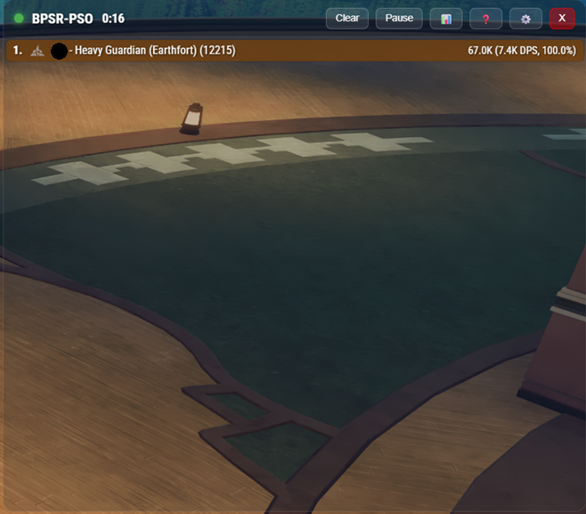
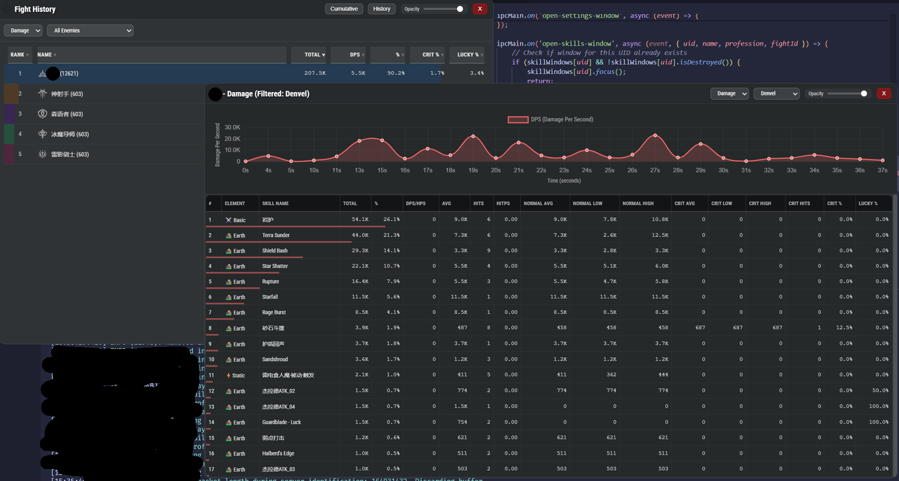
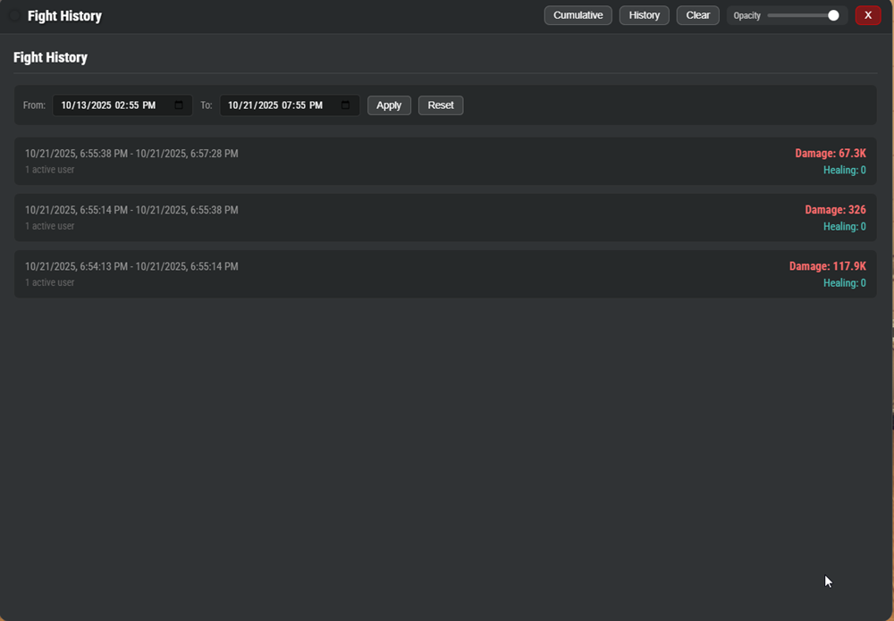

# BPSR-PSO

**Forked from:** https://github.com/dmlgzs/StarResonanceDamageCounter / https://github.com/Chase-Simmons/BPSR-PSO

Blue Protocol: Star Resonance - Per Second Overlay
Provides a useful GUI to track DPS / HPS for nearby players

## Screenshots

### Main DPS Meter



Real-time damage tracking overlay showing player performance during combat.

### Skill Breakdown



Detailed skill-by-skill analysis with DPS graphs, damage distribution, and performance metrics including critical hit rates and lucky hit percentages.

### Fight History



Track and review past encounters with damage,healing, and tanking totals across different time periods.

## About the Project

This is a standalone application and does not interface with BPSR or modify any of its files. It analyzes packet while in transit.

## Getting Started

These instructions will get you a copy of the project up and running on your local machine for development and testing purposes.

### Prerequisites

You'll need to have the following software installed:

- **Node.js**: <https://nodejs.org/>
- **npm**: Comes bundled with Node.js.
- **Npcap**: The installer is located at https://npcap.com/dist/npcap-1.84.exe

### Installation

1.  **Clone the repository:**

    ```bash
    git clone https://github.com/kar-mi/BPSR-PSO.git
    ```

2.  **Navigate into the project directory:**

    ```bash
    cd BPSR-PSO
    ```

3.  **Install Npcap:**
    - Navigate to the npcap installer at https://npcap.com/dist/npcap-1.84.exe
    - Run the Npcap installer. Be sure to select the option to **"Install Npcap in WinPcap API-compatible Mode"** during installation.
    - After installation, return to the project root: `cd ..`

4.  **Install Node.js dependencies:**
    ```bash
    npm install
    npm run rebuild
    ```

## Running the Application

To start the application, run the following command from the project root:

```bash
npm start dev
```

## Building for Production

To create a distributable build of the application:

```bash
npm run build
```

This will:

1. Rebuild native modules for Electron compatibility
2. Package the application for Windows x64
3. Create a ZIP file in the `dist/` directory

The output will be: `dist/BPSR-PSO-win32-x64.zip`

### Build Requirements

- **7z (optional)**: For better compression. The build script will automatically use 7z if installed, otherwise falls back to PowerShell's Compress-Archive.
  Added prs

```
https://github.com/Chase-Simmons/BPSR-PSO/pull/23/files
https://github.com/Chase-Simmons/BPSR-PSO/pull/20/files
https://github.com/Chase-Simmons/BPSR-PSO/pull/18/files
```

```
Translations
```

https://github.com/Zaarrg/BlueProtocolStarResonanceDataAnalysis/tree/master/Data/ProcessedGameData/StarResonanceDps_Data
