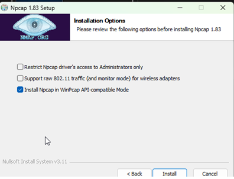

# BPSR-PSO

**Forked from:** https://github.com/dmlgzs/StarResonanceDamageCounter / https://github.com/Chase-Simmons/BPSR-PSO

Blue Protocol: Star Resonance - Per Second Overlay

A real-time damage and healing meter for Blue Protocol: Star Resonance that provides detailed performance tracking and analysis for yourself and nearby players.

## Features

- **Real-time DPS/HPS Tracking**: Monitor damage and healing output per second during combat
- **Detailed Skill Breakdown**: Analyze individual skill performance with comprehensive statistics
- **Fight History**: Review and compare past encounters with filterable date ranges
- **Enemy-Specific Analytics**: Filter damage/healing data by specific enemies
- **Comprehensive Statistics**: Track averages, critical hits, lucky hits, min/max values, and more
- **Transparent Overlay**: Customizable opacity and window positioning
- **No Game Modification**: Analyzes network packets without touching game files

## Screenshots

### Main DPS Meter

Real-time damage tracking overlay showing player performance during combat.

### Skill Breakdown

Detailed skill-by-skill analysis with DPS graphs, damage distribution, and performance metrics including critical hit rates and lucky hit percentages.
Update the skills under `src\tables\skill_names.json`

### Fight History

Track and review past encounters with damage, healing, and tanking totals across different time periods.

## Installation

### Prerequisites

Before installing BPSR-PSO, you'll need:

1. **Npcap** - Network packet capture library
    - Download: https://npcap.com/dist/npcap-1.84.exe
    - **Important**: During installation, select **"Install Npcap in WinPcap API-compatible Mode"**
    - 

### Download & Run

#### Option 1: Download Pre-built Release (Recommended)

1. Download the latest release from the [Releases page](https://github.com/kar-mi/BPSR-PSO/releases)
2. Extract the ZIP file to a folder of your choice
3. Run `BPSR-PSO.exe`

#### Option 2: Build from Source

See [DEVELOPER.md](DEVELOPER.md) for instructions on building from source.

## Usage

1. **Launch the Application**: Run `BPSR-PSO.exe`
2. **Configure Network Adapter**:
    - Click the settings button (⚙️)
    - Select your active network adapter from the dropdown
    - The application will automatically detect network traffic
3. **Start Combat**: The meter will automatically start tracking when you enter combat in Blue Protocol: Star Resonance
4. **View Details**:
    - Double-click any player to view detailed skill breakdown
    - Access fight history through the history button
    - Filter by specific enemies using the dropdown in the skill breakdown window

### Controls

- **Opacity Slider**: Adjust window transparency
- **Clear Button**: Reset current combat data
- **History Button**: View past fight records
- **Settings Button**: Configure network adapter and fight timeout

## About the Project

This is a standalone application and does not interface with Blue Protocol: Star Resonance or modify any of its files. It analyzes network packets in transit to provide real-time combat analytics. A lot of additions through Claude AI :3

**This tool is for personal use and analysis only. Use at your own risk.**

## Privacy & Security

- All data is stored locally on your computer
- No external API calls or data transmission (except CDN resources for fonts/libraries)
- Network adapter configuration is required for packet analysis
- The application only reads game traffic; it does not modify or inject packets

## Support & Issues

If you encounter any issues or have feature requests:

1. Check existing [Issues](https://github.com/kar-mi/BPSR-PSO/issues)
2. Create a new issue with detailed information about the problem
3. Include screenshots if applicable

## Contributing

Contributions are welcome! Please see [DEVELOPER.md](DEVELOPER.md) for development guidelines.

## License

See [LICENSE.txt](LICENSE.txt) for license information.

## Acknowledgments

- Original project by [dmlgzs](https://github.com/dmlgzs/StarResonanceDamageCounter)
- Continued by [Chase-Simmons](https://github.com/Chase-Simmons/BPSR-PSO)
- Translation data from [Zaarrg's Blue Protocol Data Analysis](https://github.com/Zaarrg/BlueProtocolStarResonanceDataAnalysis/tree/master/Data/ProcessedGameData/StarResonanceDps_Data)
